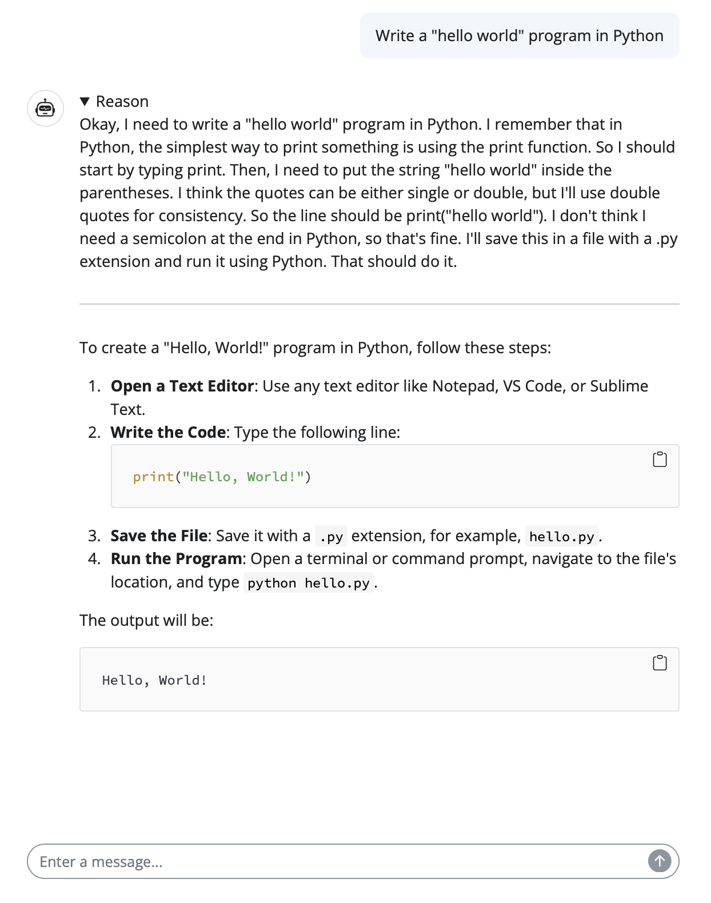

# Shiny Chatbot App with DeepSeek R1 

A minimal example of how to display message output of thinking model with [Python Shiny Chat UI](https://shiny.posit.co/py/components/display-messages/chat/)


### Key Setup

- Install [LangChain Groq](https://pypi.org/project/langchain-groq/) for DeepSeek R1 model. 

- Crete `.env` file storing `GROQ_API_KEY`

```
GROQ_API_KEY=<YOUR API KEY>
```

### Example

<p align="center">
    
</p>